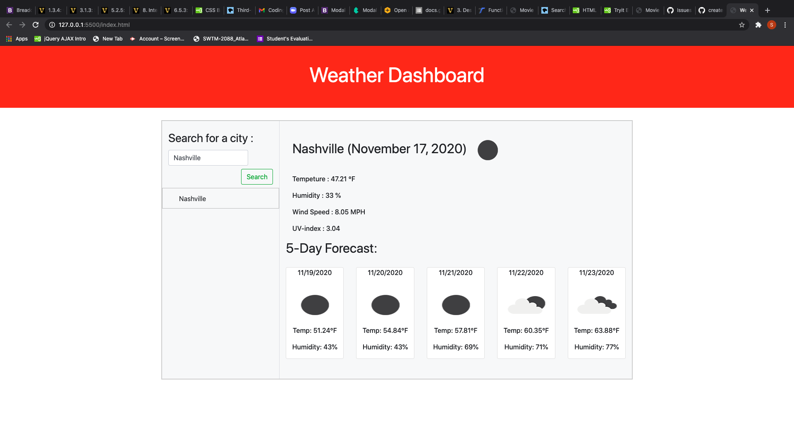

# Weather-Dashboard

## Description

This application allows people to accurately make weather forcast of any city in the weather API database. It can measure and predict the Tempeture, Humidity, Wind Speed, and UV-index of a city for five consecutive days.

## Table of Contents

- [Website](#website)
- [Built with](#built-with)
- [Usage](#usage
- [Contributors](#contributors)
- [Acknowledgements](#acknowledgements)

---

## Website

https://toksly.github.io/Weather-Dashboard/

---

## Built with

- Javascript
- HTML
- CSS

[Back to Table of Contents](#table-of-contents)

---

## Usage

To use this application, simply follow the link to the deployed application. Enter the name of the city you want to know the weather condition and click the search button.

[Back to Table of contrents](#table-of-contents)

---

## Contributors

---
---

Sylvester Nwizu

---
---

[Back to Table of Contents](#table-of-contents)

---

## Acknowledgements

- [open weather](https://openweathermap.org/)
- [jQuery](https://jquery.com/)

---

[Back to table of Contents](#table-of-contents)
